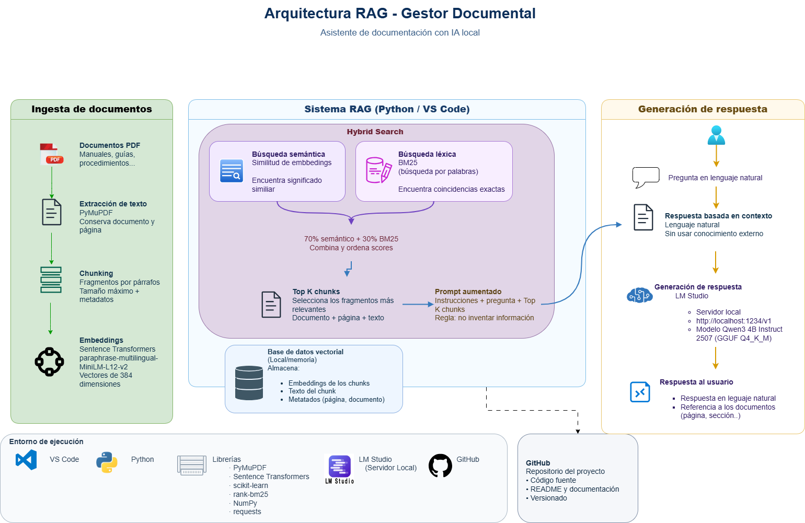

# Gestor Documental RAG

Prototipo de **Retrieval-Augmented Generation (RAG)** desarrollado desde
cero para aprender y construir un sistema de consulta inteligente sobre
documentación.

El proyecto extrae texto de documentos PDF, realiza *chunking*, genera
embeddings, recupera contexto mediante **búsqueda híbrida (semántica +
BM25)** y utiliza un **LLM local en LM Studio** para generar respuestas
basadas en los documentos.

## Arquitectura

Archivos recomendados:

-   `docs/arquitectura-rag.drawio` - diseño editable.
-   `docs/arquitectura-rag-documental-ia.png` - imagen para GitHub.

El sistema implementa un pipeline RAG completamente local, desde la ingesta y recuperación de información hasta la generación de respuestas mediante un LLM ejecutado en LM Studio.



El diseño editable de la arquitectura está disponible en:

[📐 Abrir arquitectura editable en draw.io](docs/arquitectura-rag-documental.drawio)

### Flujo

``` text
PDF
 |
 v
PyMuPDF
 |
 v
Chunking + metadatos
 |
 v
Sentence Transformers / Embeddings
 |
 +-------------------+
 |                   |
 v                   v
Semantic Search     BM25
 |                   |
 +---------+---------+
           |
           v
      Hybrid Search
           |
           v
      Top K chunks
           |
           v
   Prompt + contexto
           |
           v
LM Studio / Qwen3 4B
           |
           v
Respuesta + fuentes
```

## Tecnologías

-   Python
-   PyMuPDF
-   Sentence Transformers
-   scikit-learn
-   NumPy
-   BM25 (`rank-bm25`)
-   LM Studio
-   Qwen3 4B Instruct
-   VS Code
-   Git / GitHub

El pipeline se implementa explícitamente para facilitar el aprendizaje
de cada componente del RAG.

## Estructura

``` text
gestor-documental-rag/
|-- README.md
|-- requirements.txt
|-- .gitignore
|-- documentos/
|   `-- <documentos locales, no versionados>
|-- docs/
|   |-- arquitectura-rag.drawio
|   `-- arquitectura-rag.png
`-- src/
    |-- leer_pdf.py
    |-- chunking.py
    |-- embeddings.py
    |-- buscar.py
    |-- buscar_hibrido.py
    |-- probar_lmstudio.py
    `-- rag.py
```

## 1. Requisitos

Se recomienda:

-   Python 3.11 o 3.12.
-   Git.
-   VS Code.
-   LM Studio.
-   Un modelo local compatible con LM Studio.

Configuración utilizada durante el desarrollo:

``` text
Qwen3 4B Instruct 2507
GGUF
Q4_K_M
```

Identificador utilizado por la API:

``` text
qwen3-4b-instruct-2507
```

## 2. Clonar el repositorio

``` powershell
git clone <URL-DEL-REPOSITORIO>
cd gestor-documental-rag
```

## 3. Crear el entorno virtual

``` powershell
python -m venv .venv
```

En Windows PowerShell:

``` powershell
.\.venv\Scripts\Activate.ps1
```

Si PowerShell bloquea temporalmente la activación:

``` powershell
Set-ExecutionPolicy -Scope Process -ExecutionPolicy Bypass
.\.venv\Scripts\Activate.ps1
```

La terminal debería mostrar `(.venv)`.

## 4. Instalar dependencias

``` powershell
python -m pip install -r requirements.txt
```

## 5. Añadir un documento

Crear la carpeta si no existe:

``` powershell
mkdir documentos
```

Añadir un PDF de prueba:

``` text
documentos/
`-- documento_prueba.pdf
```

Los documentos deben mantenerse fuera de Git cuando contengan
información privada o corporativa.

Revisar en los scripts la ruta configurada:

``` python
ruta = Path("documentos/documento_prueba.pdf")
```

y adaptarla al nombre del PDF utilizado.

## 6. Probar la lectura del PDF

``` powershell
python src\leer_pdf.py
```

Comprueba que PyMuPDF puede extraer el texto y conservar el número de
página.

## 7. Probar el chunking

``` powershell
python src\chunking.py
```

El texto se divide en fragmentos manejables conservando metadatos como
documento y página.

## 8. Generar embeddings

``` powershell
python src\embeddings.py
```

Modelo utilizado:

``` text
sentence-transformers/paraphrase-multilingual-MiniLM-L12-v2
```

Cada chunk se transforma en un vector que representa su contenido
semántico.

En equipos con inspección HTTPS pueden producirse errores de certificado
al acceder a Hugging Face. El proyecto incluye `truststore` entre las
dependencias porque puede permitir utilizar el almacén de certificados
de Windows.

## 9. Probar Semantic Search

``` powershell
python src\buscar.py
```

Funcionamiento:

``` text
Pregunta
 -> embedding
 -> similitud coseno
 -> ranking
 -> chunks relevantes
```

Es recomendable probar preguntas cuya respuesta se conozca para
comprobar si se recupera el fragmento correcto.

## 10. Probar Hybrid Search

``` powershell
python src\buscar_hibrido.py
```

Combina:

-   **Semantic Search:** embeddings + similitud coseno.
-   **BM25:** coincidencia léxica y palabras clave.

La implementación inicial puede utilizar una ponderación como:

``` text
70 % semántico
30 % BM25
```

Estos pesos son experimentales y pueden ajustarse.

## 11. Configurar LM Studio

Abrir LM Studio y cargar:

``` text
Qwen3 4B Instruct 2507
GGUF Q4_K_M
```

Ir a:

``` text
Local Models -> Local Model API
```

Activar:

``` text
Local API server -> Running
```

Base URL utilizada:

``` text
http://localhost:1234/v1
```

Puede mantenerse activado **Just-in-time model loading**.

## 12. Comprobar LM Studio desde Python

``` powershell
python src\probar_lmstudio.py
```

La respuesta esperada incluye:

``` text
Código HTTP: 200
```

y el modelo:

``` text
qwen3-4b-instruct-2507
```

También puede comprobarse desde PowerShell:

``` powershell
Invoke-RestMethod http://localhost:1234/v1/models
```

## 13. Ejecutar el RAG completo

Con LM Studio en `Running`:

``` powershell
python src\rag.py
```

El programa pedirá una pregunta y ejecutará:

``` text
Pregunta
 -> Semantic Search + BM25
 -> Hybrid Search
 -> Top K chunks
 -> construcción del contexto
 -> prompt
 -> LM Studio API
 -> Qwen3
 -> respuesta
```

El LLM recibe instrucciones para utilizar únicamente el contexto
recuperado y no inventar información.

## 14. Sincronizar cambios con GitHub

Consultar cambios:

``` powershell
git status
```

Añadirlos:

``` powershell
git add .
```

Crear un commit:

``` powershell
git commit -m "Describe el cambio realizado"
```

Subirlo:

``` powershell
git push
```

Ejemplo:

``` powershell
git add .
git commit -m "Añade documentación y arquitectura"
git push
```

## 15. Seguridad

Si el repositorio es público:

-   No subir documentos corporativos o confidenciales.
-   No versionar `.env` ni credenciales.
-   No subir modelos `.gguf`.
-   No subir `.venv`.
-   Revisar `git status` antes de cada commit.
-   Utilizar documentos ficticios o públicos para las demostraciones.

El `.gitignore` debe configurarse antes de versionar archivos sensibles.

## 16. Próximas mejoras

Posibles evoluciones:

-   Múltiples documentos.
-   Base vectorial persistente.
-   Filtros por metadatos.
-   Chunking basado en estructura y secciones.
-   Reranking.
-   Evaluación del retrieval y de las respuestas.
-   Extracción estructurada de metadatos.
-   Clasificación documental.
-   Interfaz con Streamlit.
-   Carga de documentos desde la aplicación.
-   Historial de conversaciones.
-   Usuarios y permisos.
-   Docker.
-   Arquitectura equivalente en GCP.

## Objetivo de aprendizaje

El objetivo es comprender cada componente:

``` text
Ingesta -> Chunking -> Embeddings -> Retrieval -> Contexto -> LLM -> Respuesta
```

y poder evolucionar el prototipo hacia un gestor documental con IA.
